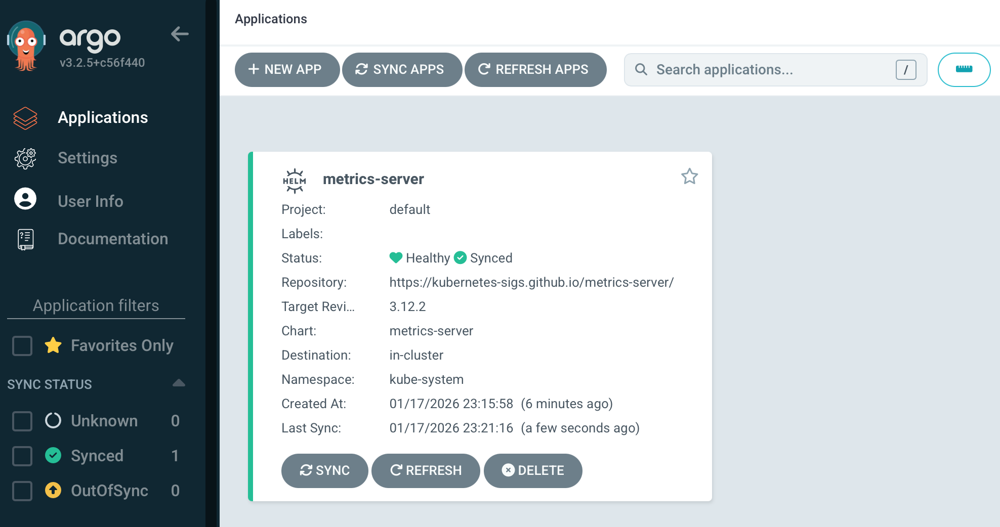

## Introduction

If you're diving into GitOps and Kubernetes, ArgoCD is one of the best tools to start with. It automates application deployment and lifecycle management using Git as the single source of truth. But where do you begin?

In this tutorial, we'll walk through deploying your first application with ArgoCD: the Kubernetes Metrics Server. This is a perfect starter project because it's simple, essential for any cluster, and demonstrates all the core ArgoCD concepts you need to know.

## What You'll Learn

- How to install ArgoCD on your Kubernetes cluster
- Understanding ArgoCD Application manifests
- Deploying Helm charts through ArgoCD
- Configuring automated sync policies
- Verifying your deployment

## Prerequisites

Before we start, make sure you have:

- A running Kubernetes cluster (minikube, k3s, EKS, GKE, etc.)
- `kubectl` configured and connected to your cluster
- `helm` v3+ installed
- Basic understanding of Kubernetes concepts

## Why Metrics Server?

The Metrics Server is a cluster-wide aggregator of resource usage data. It collects metrics like CPU and memory usage from Kubelets and exposes them through the Kubernetes API. This enables commands like `kubectl top nodes` and `kubectl top pods`, and is essential for Horizontal Pod Autoscaling (HPA).

It's the perfect first ArgoCD application because:
- It's lightweight and quick to deploy
- Every cluster needs it
- It demonstrates Helm chart deployment via ArgoCD
- You can immediately verify it's working

## Step 1: Install ArgoCD

First, let's get ArgoCD running on your cluster. We'll use Helm for a clean installation:

```bash
# Add the Argo Helm repository
helm repo add argo https://argoproj.github.io/argo-helm
helm repo update argo

# Install ArgoCD in the 'argo' namespace
helm install argo argo/argo-cd -n argo --create-namespace

# Wait for ArgoCD to be ready
kubectl wait --for=condition=available --timeout=300s \
  deployment/argo-argocd-server -n argo
```

### Access the ArgoCD UI

Retrieve the initial admin password:

```bash
kubectl -n argo get secret argocd-initial-admin-secret \
  -o jsonpath="{.data.password}" | base64 -d
```

Port-forward to access the UI:

```bash
kubectl port-forward service/argo-argocd-server -n argo 8080:443
```

Open your browser to `https://localhost:8080` and login with:
- Username: `admin`
- Password: (the password you retrieved above)

## Step 2: Understanding the ArgoCD Application Manifest

ArgoCD uses a custom Kubernetes resource called an `Application` to define what should be deployed. Let's break down the manifest for our Metrics Server deployment:

```yaml
apiVersion: argoproj.io/v1alpha1
kind: Application
metadata:
  name: metrics-server
  namespace: argo
spec:
  project: default
  source:
    repoURL: https://kubernetes-sigs.github.io/metrics-server/
    targetRevision: 3.12.2
    helm:
      parameters:
        - name: args[0]
          value: '--kubelet-insecure-tls'
    chart: metrics-server
  destination:
    server: https://kubernetes.default.svc
    namespace: kube-system
  syncPolicy:
    automated:
      prune: true
      selfHeal: true
    syncOptions:
      - CreateNamespace=true
```

Let's understand each section:

### Metadata
- `name`: The application name in ArgoCD
- `namespace`: ArgoCD applications live in the `argo` namespace

### Source
- `repoURL`: The Helm chart repository URL
- `targetRevision`: The specific chart version to deploy
- `helm.parameters`: Custom values for the Helm chart
- `chart`: The name of the Helm chart

### Destination
- `server`: The Kubernetes cluster to deploy to (in-cluster in this case)
- `namespace`: Where to deploy the application

### Sync Policy
- `automated`: Enables automatic synchronization
- `prune`: Removes resources that are no longer defined
- `selfHeal`: Automatically corrects drift from the desired state
- `syncOptions`: Additional sync behaviors

### Why `--kubelet-insecure-tls`?

In development environments, Kubelet certificates might not be properly configured. This flag allows the Metrics Server to skip TLS verification. **Note**: In production, you should properly configure TLS certificates instead.

## Step 3: Deploy Metrics Server via ArgoCD

Create a file named `metrics-server-app.yaml` with the manifest above, then apply it:

```bash
kubectl apply -f metrics-server-app.yaml -n argo
```

That's it! ArgoCD will now:
1. Fetch the Helm chart from the repository
2. Apply the custom parameters
3. Deploy to the `kube-system` namespace
4. Monitor for any changes

## Step 4: Verify the Deployment

### Check ArgoCD Application Status

```bash
kubectl get application metrics-server -n argo
```

You should see output like:

```
NAME             SYNC STATUS   HEALTH STATUS
metrics-server   Synced        Healthy
```

### Check the Pods

```bash
kubectl get pods -n kube-system | grep metrics-server
```

You should see the metrics-server pod running:

```
metrics-server-5d4f8c7b9-xyz12   1/1     Running   0          2m
```

### Test the Metrics API

Wait a minute for metrics to be collected, then try:

```bash
kubectl top nodes
```

You should see CPU and memory usage for your nodes:

```
NAME       CPU(cores)   CPU%   MEMORY(bytes)   MEMORY%
node-1     250m         12%    2048Mi          25%
```

## Step 5: Explore the ArgoCD UI

Now let's see what this looks like in the ArgoCD UI:

1. Navigate to `https://localhost:8080` (if you closed the port-forward, run it again)
2. Click on the `metrics-server` application
3. You'll see a visual representation of all deployed resources



The UI shows:
- **Sync Status**: Whether the live state matches Git
- **Health Status**: Whether resources are healthy
- **Resource Tree**: Visual graph of all Kubernetes resources
- **Events**: Recent activities and changes
- **Logs**: Container logs for debugging

## Understanding ArgoCD's GitOps Workflow

Now that you have your first application deployed, let's understand what just happened:

1. **Declarative Configuration**: You defined the desired state in YAML
2. **Git as Source of Truth**: ArgoCD monitors the Helm repository
3. **Automated Sync**: Changes are automatically applied
4. **Self-Healing**: If someone manually changes the deployment, ArgoCD reverts it
5. **Audit Trail**: All changes are tracked and visible

## What Happens When You Update?

Let's say you want to upgrade to a newer version. Simply update the `targetRevision` in your manifest:

```yaml
source:
  targetRevision: 3.13.0  # Changed from 3.12.2
```

Apply the change:

```bash
kubectl apply -f metrics-server-app.yaml -n argo
```

ArgoCD will automatically:
- Detect the change
- Fetch the new chart version
- Perform a rolling update
- Verify health status

## Common Troubleshooting

### Application Shows "OutOfSync"

This means the live state doesn't match the desired state. Click "Sync" in the UI or run:

```bash
kubectl patch application metrics-server -n argo \
  --type merge -p '{"operation":{"initiatedBy":{"username":"admin"},"sync":{}}}'
```

### Pods Not Starting

Check the events:

```bash
kubectl describe pod -n kube-system -l app.kubernetes.io/name=metrics-server
```

### Metrics Not Available

Wait 1-2 minutes after deployment for metrics to be collected. If still not working:

```bash
kubectl logs -n kube-system -l app.kubernetes.io/name=metrics-server
```

## Best Practices

### 1. Use Specific Versions
Always pin to specific chart versions rather than using `latest`:

```yaml
targetRevision: 3.12.1  # Good
targetRevision: "*"     # Avoid
```

### 2. Store Manifests in Git
In production, store your ArgoCD Application manifests in a Git repository. This enables:
- Version control
- Code review
- Rollback capabilities
- True GitOps workflow

### 3. Use Projects for Organization
As you add more applications, organize them into ArgoCD Projects:

```yaml
spec:
  project: monitoring  # Instead of 'default'
```

## Next Steps

Now that you've deployed your first application with ArgoCD, you can:

1. **Deploy More Applications**: Try deploying Prometheus, Grafana, or your own apps
2. **Use App of Apps Pattern**: Manage multiple applications with a single parent app
3. **Implement Multi-Environment**: Use different branches for dev/staging/prod
4. **Add CI/CD Integration**: Trigger deployments from your CI pipeline
5. **Explore ApplicationSets**: Deploy to multiple clusters simultaneously

## Conclusion

Congratulations! You've successfully deployed your first application using ArgoCD. The Metrics Server example demonstrates the core concepts of GitOps:

- Declarative configuration
- Automated synchronization
- Self-healing capabilities
- Audit and visibility

ArgoCD transforms Kubernetes deployments from imperative commands to declarative, version-controlled configurations. This approach reduces errors, improves collaboration, and makes your infrastructure more reliable.

The beauty of ArgoCD is that whether you're deploying a simple metrics server or a complex microservices architecture, the pattern remains the same. You define the desired state, and ArgoCD ensures your cluster matches it.

## Resources

- [ArgoCD Documentation](https://argo-cd.readthedocs.io)
- [Metrics Server GitHub](https://github.com/kubernetes-sigs/metrics-server)
- [Helm Charts](https://helm.sh/)
