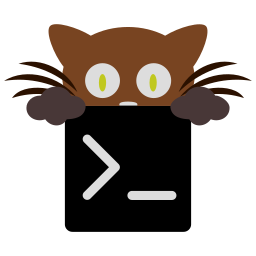

<h1>📚 Cheatsheets</h1>

Quick reference guides for tools used in the homelab.

 

<table>
  <tr>
    <td align="center" width="200">
      <a href="crictl/">
         
        <b>crictl</b>
      </a>
       Container Runtime Interface
    </td>
    <td align="center" width="200">
      <a href="helm/">
         
        <b>Helm</b>
      </a>
       Kubernetes Package Manager
    </td>
    <td align="center" width="200">
      <a href="k9s/">
         
        <b>k9s</b>
      </a>
       Kubernetes Terminal UI
    </td>
  </tr>
  <tr>
    <td align="center" width="200">
      <a href="kitty/">
         
        <b>Kitty</b>
      </a>
       GPU-based Terminal Emulator
    </td>
    <td align="center" width="200">
      <a href="terraform/">
         
        <b>Terraform</b>
      </a>
       Infrastructure as Code
    </td>
    <td align="center" width="200">
      <a href="tmux/">
         
        <b>tmux</b>
      </a>
       Terminal Multiplexer
    </td>
  </tr>
</table>

## Available Cheatsheets

| Tool | Description |
|------|-------------|
| [crictl](crictl/) | Container runtime debugging commands for Kubernetes nodes |
| [Helm](helm/) | Kubernetes package management — repos, charts, releases, and development |
| [k9s](k9s/) | Terminal UI for navigating and managing Kubernetes clusters |
| [Kitty](kitty/) | GPU-accelerated terminal emulator with tabs, splits, and kittens |
| [Terraform](terraform/) | Infrastructure as Code — init, plan, apply, state, and utilities |
| [tmux](tmux/) | Terminal multiplexer — sessions, windows, panes, and copy mode |
