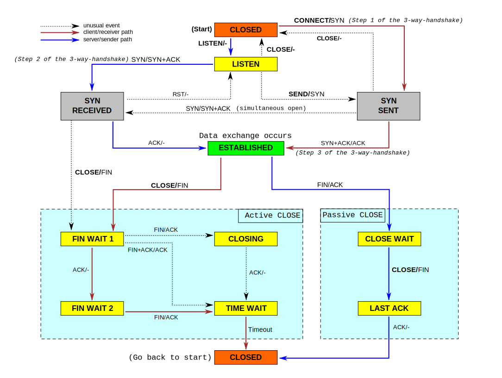
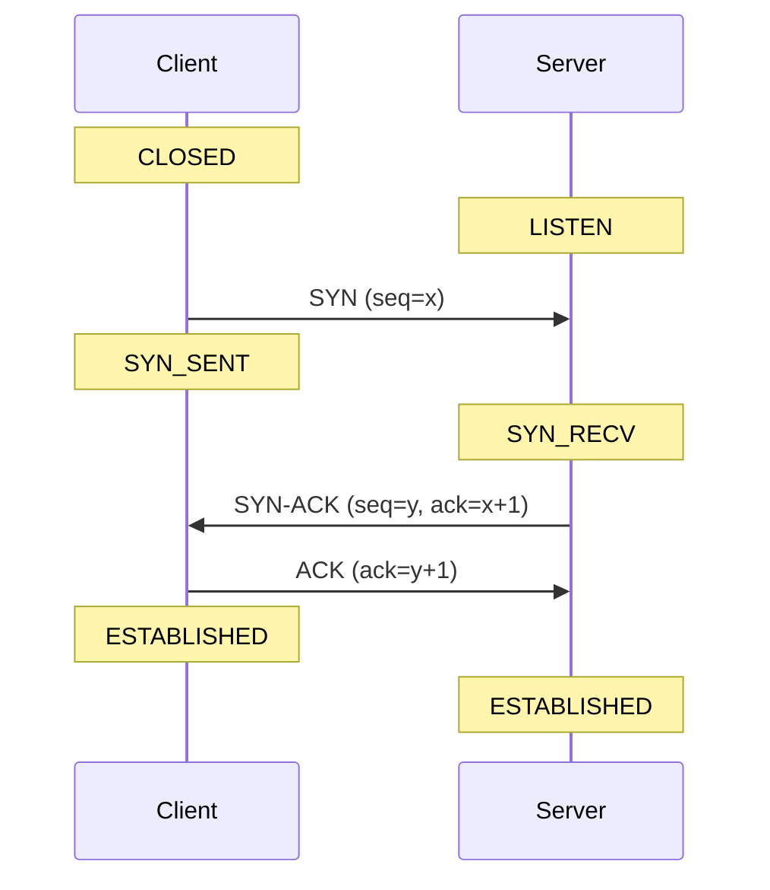
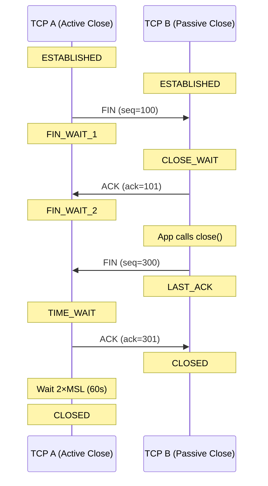

# TCP States Explained

## TCP Connection Overview

TCP is a **full-duplex**, connection-oriented protocol operating at the transport layer. A TCP connection goes through three phases:

1. **Connection establishment** — 3-way handshake (SYN → SYN-ACK → ACK)
2. **Data transfer** — bidirectional data flow (ESTABLISHED state)
3. **Connection termination** — 4-way handshake (FIN → ACK → FIN → ACK)

The connection passes through **11 states** during its lifetime: CLOSED, LISTEN, SYN_SENT, SYN_RECV, ESTABLISHED, FIN_WAIT_1, FIN_WAIT_2, CLOSE_WAIT, CLOSING, LAST_ACK, TIME_WAIT.

The OS manages each connection as a resource (socket + file descriptor). The `ss` command lets you inspect these states in real time.

## TCP State Transition Diagram

## Connection Establishment (3-Way Handshake)

## Connection Termination (4-Way Handshake)

## TCP States Reference (RFC 793)

| State | Who Has It | Definition | Meaning in Practice | Concern |
|-------|-----------|-----------|---------------------|---------|
| **CLOSED** | Neither | No connection exists | Connection fully terminated | Normal |
| **LISTEN** | Server | Waiting for a connection request from a remote endpoint (passive open) | Socket waiting for incoming connections (your service is ready) | If missing, service is down |
| **SYN_SENT** | Client | Sent a SYN, waiting for SYN-ACK (active open initiated) | Sent SYN, waiting for SYN-ACK from remote | Stuck = remote not reachable |
| **SYN_RECV** | Server | Received a SYN, sent SYN-ACK, waiting for final ACK (half-open) | Got SYN, sent SYN-ACK, waiting for final ACK | Many = SYN flood attack |
| **ESTABLISHED** | Both | Three-way handshake complete, connection is open and data flows | Connection is active, data flowing both ways | Normal healthy state |
| **FIN_WAIT_1** | Active closer | Sent a FIN (active close initiated), waiting for ACK or FIN | Your side sent FIN, waiting for remote ACK | Stuck = remote unresponsive or firewall issue |
| **FIN_WAIT_2** | Active closer | Received ACK for our FIN, waiting for remote's FIN | Remote ACKed the FIN, waiting for remote's FIN | Stuck = remote app not closing |
| **CLOSE_WAIT** | Passive closer | Received FIN from remote, sent ACK, waiting for local app to close | Remote closed, YOUR app hasn't called `close()` yet | App bug if growing — memory/fd leak |
| **CLOSING** | Both | Both sides sent FIN simultaneously, waiting for ACK | Both sides sent FIN simultaneously | Rare, transient |
| **LAST_ACK** | Passive closer | Sent FIN after receiving remote's FIN, waiting for final ACK | Sent FIN after CLOSE_WAIT, waiting for final ACK | Stuck = firewall dropping packets |
| **TIME_WAIT** | Active closer | Waiting 2×MSL (typically 60s) before fully closing, ensures late packets are handled | Connection closed properly, socket stays 60s for late packets | Normal, but too many = port exhaustion |
